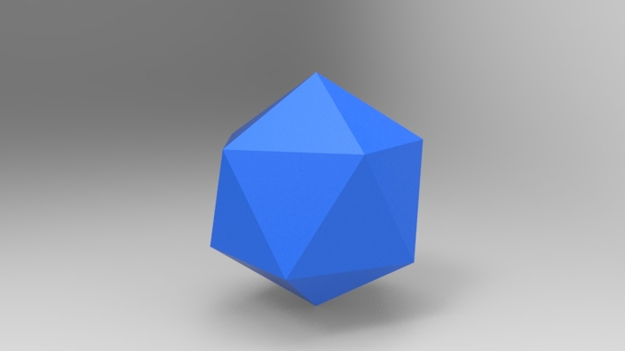

# Holograph-it

Tools for generating real-life holograms from 3D models. `holoscribe` takes 3D models and generates SVGs. `holoviz` creates animated visualizations.

1. Start with a 3D model such as an OBJ file. 
2. Generate a list of points in 3D space. 
3. Generate circles from the points, with circle diameter as a function of the depth of the point. 
4. Select properties of the incident light-source and simulate a the hologram. 
5. Generate G-code and scribe one for real.

Inspiration: https://www.youtube.com/watch?v=sv-38lwV6vc

Written in Rust, because we can.
